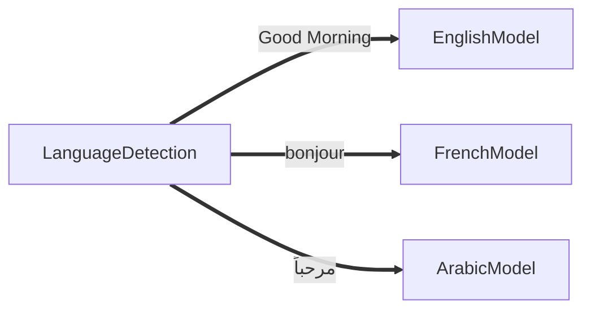

# Chatbot
This Chatbot support English, French, Arabic and soon tunisian dialect. 

I strongly recommend working in an isolated environment so you can work on different projects without having conflicting library versions (because you may need a different version of frameworks or languages that you already have!)

For every single message from the user, the chatbot has to figure out the language and respond to this message based on the "intents" file for it. (Please feel free to add more intents)

Here is a simple flow chart:



Once you clone the project you can try it out:
 ```
 git clone https://github.com/MosbehBarhoumi/Chatbot.git
 cd Chatbot 
 python app.py
```


